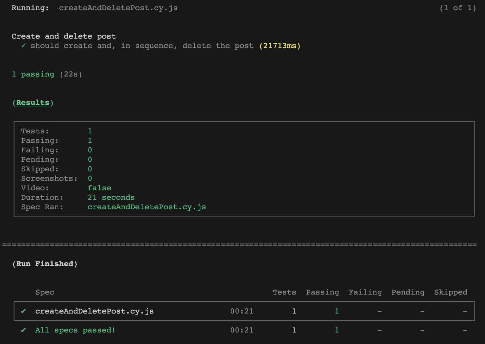
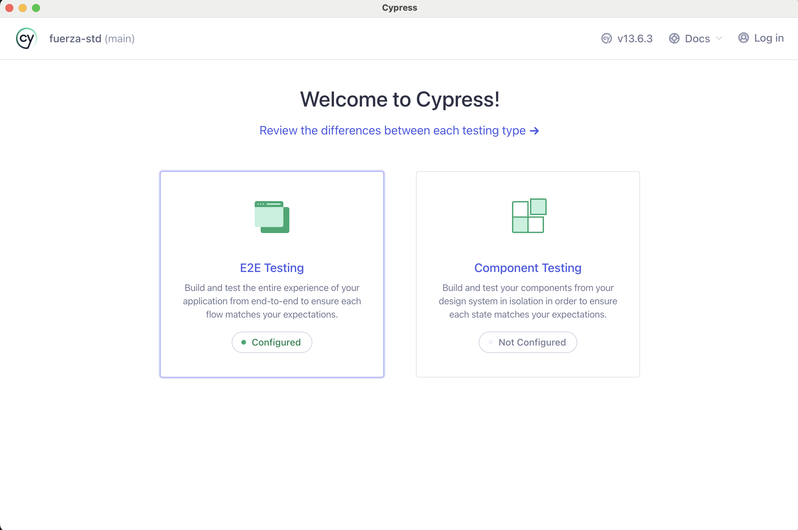

# fuerza-std

# E2E - Tests
This project only contains a test file that must perform the action of creating a new blog post and immediately deleting it. The user must be logged in before performing these actions.

# Install:
- Node v20
- yarn or use npm

Create a `.env` file in the project root according to the `.env.example` file and enter your github login.

# Run spec headless (No browser interaction)
- `yarn cy:run`

You should to see something like this:

# Open cypress and interact with browser
- `yarn cy:open`

You should to see something like this:

You need to select `E2E Testing` and select the spec.